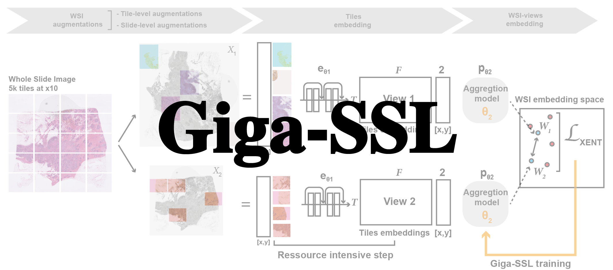

This repository allows you to:
* [Perform any classification task](#perform-any-classification-task-on-the-tcga)
* [Replicate the results of the paper](#replicate-the-results-of-the-paper) : **[CVPRW Paper](https://openaccess.thecvf.com/content/CVPR2023W/CVMI/papers/Lazard_Giga-SSL_Self-Supervised_Learning_for_Gigapixel_Images_CVPRW_2023_paper.pdf)**
* [Train a Giga-SSL model on your own dataset](#train-a-giga-ssl-model-on-your-own-dataset)
* [compute your WSI representations](#compute-the-giga-ssl-representations)

> **NOTE** If you only want to encode WSIs using pre-trained Giga-SSL models, please visit [https://github.com/trislaz/Democratizing_WSI](https://github.com/trislaz/Democratizing_WSI)
> You will find there a simple one-command line API to do that, using a variety of Giga-SSL architecture and tile-embedding models.

# Perform any classification task on the TCGA

For benchmarking or research purposes, the Giga-SSL embeddings provide an extremely quick way to perform a classification task on the TCGA.
Using the TCGA embeddings to perform linear classification only requires the dependencies in `requirements_lin.yml`
```
conda env create -f requirements_lin.yml && conda activate linear_probing && conda list
```

## Build the label csv

The csv file should contain at least two columns: `ID` and `label`:
* `ID` is the name of the WSI file (without the extension), for instance `TCGA-A7-A6VV-01Z-00-DX1.07AE0E16-A883-4C86-BC74-4E13081175F2`.
* `label` is the label of the WSI, for instance `TNBC` or `luminal`. It does not have to be binary.

## Perform classification

The whole Formalin-Fixed Paraffin-Embedded (FFPE) of the TCGA, available [here](https://portal.gdc.cancer.gov/) is encoded by our Giga-SSL model. 
These representations are available in the folder `TCGA_encoded_t5e1000`.

In order to perform classification, use the script `linear_evaluation.py` with the following arguments:
* --dataset: path of the encoded WSI dataset.
* --csv: the path to the csv file containing the labels of the dataset.
* --splitdir: the path to the folder containing the train/test split of the dataset. **If None, the results are randomly 5-fold cross-validated**.

Example:
```
python linear_evaluation.py --dataset ./TCGA_encoded_t5e1000 --csv tables/lung.csv --splitdir ./splitdirs/lung/full
```

Or, without using pre-split:
```
python linear_evaluation.py --dataset ./TCGA_encoded_t5e1000 --csv tables/lung.csv
```
The tables and splitdirs used in the paper are present in `tables`and splitdirs`.

In the present splitdirs, the train/test split is the same as in the one used in the papers. 
The subdirectories `full`, `25p` correspond to the full dataset and to a 25% of the dataset, respectively.
The subdirectories featuring only a number `n` correspond to splits with n slides in the training set.

While a `.csv`is mandatory, splitdirs files are not.

# Replicate the results of the paper

Finally, to perform all the classification tasks present in the paper, just use `compute_results.py`

```
python compute_results.py
```

or, using the train/test splits of the paper:
```
python compute_results.py --fixsplit
```


# Train a Giga-SSL model on your own dataset

To perform a full Giga-SSL training you will need more python dependencies. First install all the one listed in requirements.yml:
You may want to install the pytorch version appropriate to your cuda version (if so, change if in requirements.yml).

```
conda env create -f requirements.yml && conda activate gigassl 
```

Then install [SparseConvNet](https://github.com/facebookresearch/SparseConvNet), following the instruction on its github repository. 

Two steps are then necessary to train a Giga-SSL model on your own dataset:
* Augment, encode and store the tiles of the WSIs of your dataset.
* Train a Giga-SSL model on these tiles.

Both of these steps are easily done using `tiling.sh` and `run_ssl.sh`.
However, they are SBATCH files and are designed to be run on a SLURM cluster.
If you want to run them on your own computer, you'll have to adapt them or used directly the python file that these bash files run with a job-array.

## Augment, encode and store:

In `tiling_sharedaug.sh` you have to fill the following variables:
* tiler_type: the type of tiling you want to use. To generated a shared-augmentation version of the dataset, set it to 'SharedAugTiler'.
* path_wsi: the path to the folder containing the WSIs of your dataset.
* ext: the extension of the WSIs of your dataset.
* path_outputs: the path to the folder where you want to store the augmented tiles, input for the Giga-SSL model.
* model_path (optional): the path to the MoCo model used to encode the tiles. If None, the model used is a ResNet18 pretrained on Imagenet.
* level: the level of the WSI at which the tiles are extracted.
* tiler: either `imagenet` or `moco`. If `moco`, you have to provide a MoCo model in the `model_path` variable.
* normalizer: either `macenko` or None. Using `macenko` will first normalize the tiles with the Macenko method with the reference image being build_dataset/reference_macenko.png TODO add the macenko image.
* Naug: number of random augmentation of tiles used per WSI. (Recommended: 25)
* Nt: number of tiles per augmentation. (Recommended: 25)
* NWSI: number of WSIs to encode in each job of the job-array.
* num_worker: number of workers used to encode the tiles.

Then, you can run the script:

```
sbatch tiling.sh
```

## Train a Giga-SSL model on these tiles:

The code implementing the SimCLR algorithm is taken from https://github.com/PatrickHua/SimSiam
Credit is given at the top of the concerned files.

In `run_ssl.sh` you can change the `jobname` parameter in the SBATCH header and specify the path to the config file to use for training.
The config file is a yaml file containing the parameters of the training.
A default config file is provided in `gigassl/configs/simclr_mil_scm.yaml`.

Then, you can run the script:
```
sbatch run_ssl.sh
```

The trained models are saved in the folder `gigassl/CHECKPOINTS/` and the tensorboard logs are saved in the folder `gigassl/LOGS/`.

The models are then saved in the folder `./CHECKPOINTS/$jobname`.

# Compute the Giga-SSL representations of WSIs

After training a Giga-SSL model, you can compute the representations of the WSIs of your dataset using the script `gigassl/inference.py`

You will first need to encode exhaustively all of your WSI dataset without augmentations.
To do that, you just need to run `tiling.sh` with `tiler_type='NormalTiler'`, and using precisely the same other arguments as 
you created the augmented version of the dataset.

The non-augmented version of the dataset will be available under the path `${path_outputs}_normal` in the `tiling.sh` script.

Then, you can run the script `gigassl/inference.py` with the following arguments:

* --dataset: the path to the folder containing the non-augmented version of the dataset (`${path_outputs}_normal`)
* --model: the path to the trained Giga-SSL model.
* --ensemble: the number of bootstrapped WSI (composed each time of `$nb_tiles` tiles) to average for the final representation.
* -o: the path to the folder where you want to store the representations of the WSIs.

A slurm script is provided to run the inference on a SLURM cluster: 

```
sbatch infer.sh
```

In the output directory you will have a `embeddings.npy` and `ids.npy` files, providing respectively the embeddings of the WSIs and their names.
It is then immediately possible to use these embeddings to perform a linear evaluation of the Giga-SSL model, using the previous scripts.
